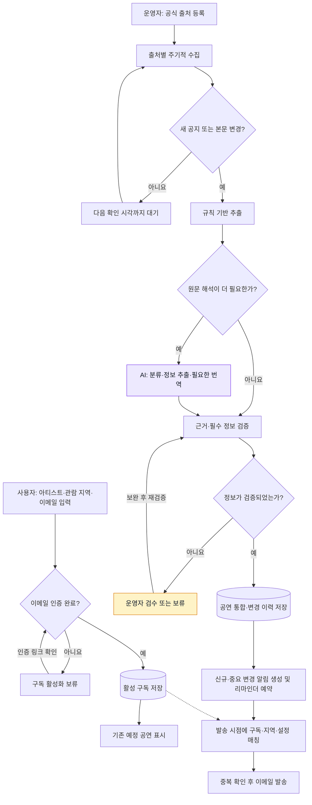
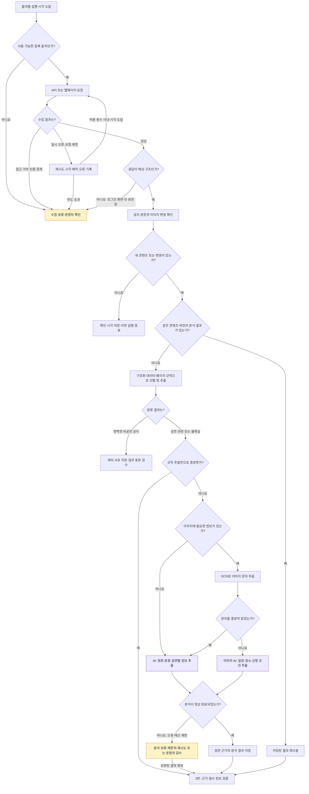
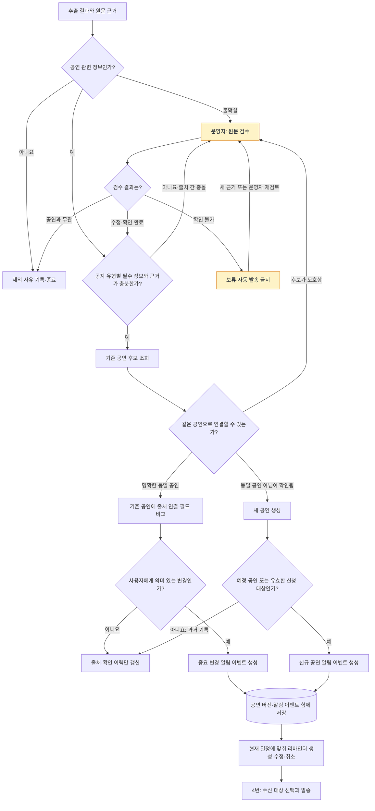
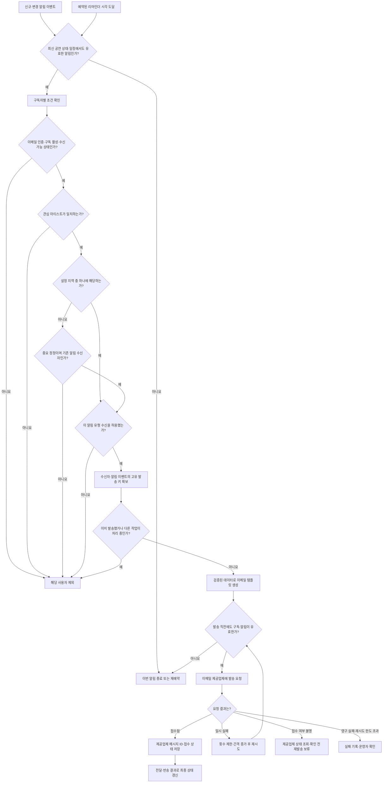

# On My Radar — 서비스 순서도

[서비스 기획서](./PROJECT_PLAN.md)를 구체화한 설계 제안이다. 실제 구현 전 확인 주기·재시도 횟수·알림 시점을 확정한다.

## 읽는 방법

- 위에서 아래로 진행한다. 마름모는 다음 단계로 넘어갈 조건이며, 화살표에 판단 결과를 표시한다.
- 보라색은 AI 사용 단계, 노란색은 운영자 검수 단계다. 색상 없이도 구분되도록 이름을 함께 적었다.
- 수집과 분석은 모든 사용자에게 공통으로 수행하고, 마지막에 사용자별 알림 대상을 선택한다.
- AI는 원문 해석을 돕는다. 지역 비교, 중복 발송 방지, 시간 계산과 발송 승인은 규칙과 저장된 상태로 처리한다.

## 1. 전체 배치

구독 활성화와 정보 수집은 독립적이다. 사용자가 가입할 때마다 크롤러를 실행하지 않는다. 지원 아티스트와 공식 출처는 운영자가 먼저 연결하며, 미지원 아티스트 신청은 별도 검토 대기열에 저장한다.

## 2. 수집 → 변경 감지 → AI 사용 판단

**다음 단계로 넘어가는 핵심 조건**

| 판단 | 통과 기준 | 통과하지 못하면 |
|---|---|---|
| 수집 정상 | 실제 공지 본문을 얻었고 예상한 구조임 | 오류로 기록한다. 공연 없음으로 판단하지 않는다. |
| 콘텐츠 변경 | 메뉴·광고를 제외한 본문 또는 관련 이미지가 변경됨 | 분석하지 않고 종료한다. |
| 결과 재사용 | 콘텐츠 버전과 추출기·프롬프트 버전이 모두 동일함 | 다시 추출한다. |
| 비공연 제외 | 음반 판매 등 공연·신청·공연 변경과 무관함이 명확함 | 불확실한 글은 AI 분석 대상으로 남긴다. |
| 규칙 추출 충분 | 공지 종류와 원문이 제공하는 필요한 항목을 근거와 함께 읽을 수 있음 | AI로 해석한다. 원문 자체에 없는 정보는 AI도 채우지 않는다. |

키워드가 없다는 이유만으로 제외하지 않는다. 공지에 여러 공연이나 여러 접수 일정이 있으면 각각 분리해 추출한다. 변경이 없어도 추출 규칙 수정이나 운영자의 재처리 요청이 있으면 저장된 원문을 다시 분석할 수 있다.

## 3. 검증 → 동일 공연 연결 → 알림 사유 생성

### 공지별 검증 조건

| 공지 종류 | 필요한 정보 | 허용할 수 있는 미확정 정보 |
|---|---|---|
| 신규 공연 | 아티스트 식별, 대상 국가, 공식 근거, 공연을 구분할 수 있는 일정·이름 등 | 공식적으로 미정인 공연장·상세 시간은 미정으로 표시 |
| 예매·추첨 일정 | 대상 공연 연결, 신청 종류, 공지된 시작·마감과 시간대, 공식 안내 링크 | 공개되지 않은 시작·마감은 미정으로 두고 해당 리마인더는 만들지 않음 |
| 취소·연기 | 기존 공연 식별, 공식 변경 근거, 변경 상태 | 연기 후 새 날짜가 없어도 변경 알림 가능 |
| 장소·시간 변경 | 기존 공연 식별, 변경된 값과 공식 근거 | 다른 필드는 검증된 기존 값 유지 |

AI가 스스로 부여한 확신 점수만으로 통과시키지 않는다. 날짜 해석 가능 여부, 원문 근거, 아티스트 식별, 기존 정보와의 충돌을 별도로 검사한다. 연도·시간대를 근거 있게 확정할 수 없으면 보류한다.

### 동일 공연 판단과 변경 처리

- 공식 공연 ID 또는 예매 URL을 우선 활용하고, 아티스트·날짜·공연장·회차를 보조 비교한다.
- 날짜와 장소가 바뀌는 연기 공지는 기존 공연과 연결해야 한다. 날짜가 다르다는 이유만으로 새 공연을 만들지 않는다.
- 이름이 비슷한 아티스트, 같은 날 다른 회차, 여러 날 열리는 페스티벌은 자동 병합하지 않는다.
- 예매 시작·마감 추가, 신청 조건 변경, 취소·연기, 장소·시간 변경은 알림 대상이다. 오탈자·장식·동일 공지 재게시만으로는 알리지 않는다.
- 페이지에서 공지가 사라진 것만으로 공연 취소를 추정하지 않는다.
- 취소 시 기존 리마인더를 취소한다. 접수 일정 변경 시 예전 작업을 무효화하고 새 일정으로 예약한다.

## 4. 사용자 매칭 → 중복 방지 → 발송

### 매칭과 발송의 세부 규칙

- 기본 매칭은 `활성 구독 AND 아티스트 일치 AND 지역 조건 중 하나 충족 AND 알림 유형 허용`이다.
- 첫 버전은 공연 국가로 비교한다. 이후 도시·거리 조건을 추가해도 지역 조건끼리는 OR로 결합한다.
- 공연이 다른 지역으로 옮겨졌다면 기존 알림 수신자에게도 중요 정정을 전달한다. 단, 구독 해지와 수신 설정은 항상 우선한다.
- 신규 구독자는 기존 공연을 초기 조회로 확인한다. 과거 신규 알림을 일괄 재발송하지 않고, 앞으로 발생할 변경과 아직 유효한 리마인더를 받는다.
- 사용자 가입 시에도 기존 공연의 미래 신청 일정을 확인해 선택한 리마인더를 연결한다.
- 리마인더는 정확한 시각·시간대가 확정되어 있고 발송 예정 시각이 미래일 때만 예약한다. 지연된 작업은 마감 등 기준 시각이 이미 지났으면 폐기한다.
- 중복 키는 일반 알림의 경우 `구독 ID + 알림 이벤트 ID`, 리마인더는 `구독 ID + 신청 일정 ID + 일정 버전 + 리마인더 종류`로 구성한다.
- 중복 확인과 발송 작업 확보는 원자적으로 수행한다. 시간 초과로 제공업체 접수 여부가 불명확하면 무작정 재전송하지 않는다. 제공업체가 지원하면 동일 멱등 키를 재사용한다.
- 이메일 제공업체의 요청 접수와 실제 전달 완료는 구분한다. 영구 반송된 주소는 추가 발송을 중지한다.

## 5. AI 사용 경계 요약

| 작업 | AI 사용 | 판단 방식 |
|---|---|---|
| 주기 실행·페이지 변경 감지 | 사용하지 않음 | 스케줄러, 본문·이미지 버전 비교 |
| 구조가 일정한 공지 추출 | 원칙적으로 사용하지 않음 | API·페이지별 추출 규칙 |
| 공연 관련 여부가 애매한 글 | 사용 | 다국어 문맥 분류, 불확실하면 검수 |
| 자유로운 문장의 공연·신청 일정 | 사용 | 구조화 추출과 필드별 원문 근거 보존 |
| 이미지 속 일정 | 필요할 때 사용 | OCR 우선, 부족하면 이미지 AI |
| 한국어 번역·신청 조건 요약 | 필요할 때 사용 | 변경된 원문 단위로 한 번 생성·저장, 사실 필드 검증 |
| 날짜 계산·지역 매칭 | 사용하지 않음 | 시간대·국가 코드·좌표를 이용한 규칙 |
| 공연 중복 후보 탐색 | 초기에는 규칙 우선 | 모호하면 운영자 검수 |
| 발송 결정·중복 방지·재시도 | 사용하지 않음 | 구독 설정, 공연 버전, 발송 상태 |
| 이메일 본문 조립 | 원칙적으로 사용하지 않음 | 검증된 필드를 템플릿에 삽입 |

AI 결과에는 공지 종류, 아티스트 후보, 공연별 일정과 장소, 신청 일정·조건, 원문 근거, 불확실한 항목을 포함한다. 원문에 없는 값을 생성하거나 원문에 포함된 지시를 실행하지 않는다.

## 6. 예시로 따라가기

| 상황 | 진행 경로 | 결과 |
|---|---|---|
| 공식 페이지를 다시 확인했지만 변화 없음 | 수집 → 변경 없음 | AI 호출·알림 없음 |
| 정해진 형식의 한국 공연 공지 추가 | 규칙 추출 → 검증 → 새 공연 → 지역 매칭 | 한국을 선택한 구독자에게 신규 알림 |
| 일본어 이미지에 추첨 마감일 추가 | 변경 감지 → OCR 또는 이미지 AI → 검증 → 기존 공연 갱신 | 일정 추가 알림·마감 리마인더 예약 |
| 같은 공연이 다른 공식 출처에 재게시 | 추출 → 동일 공연 연결 → 의미 있는 변경 없음 | 출처만 추가, 중복 알림 없음 |
| 공식 취소 공지에 원래 날짜가 빠짐 | 기존 공연 식별 시도 → 모호하면 검수 | 식별 완료 후 취소 알림·리마인더 취소 |
| 발송 대기 중 사용자가 구독 해지 | 발송 직전 구독 확인 실패 | 발송하지 않음 |

이 예시들은 설계 설명용이며 실제 공연 정보를 나타내지 않는다.
